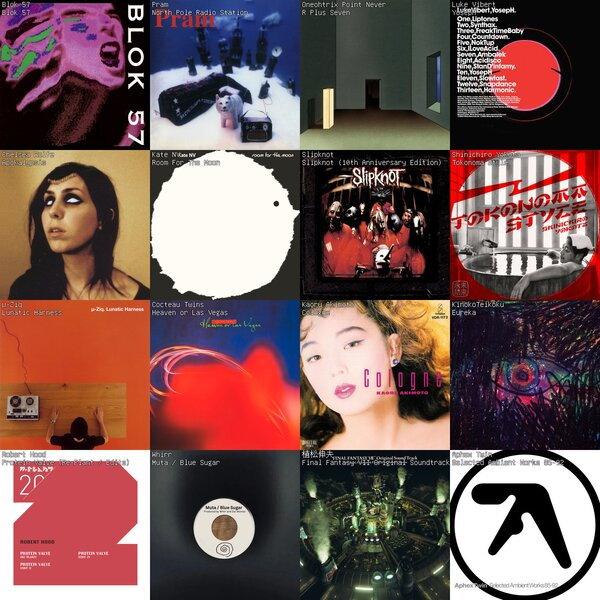
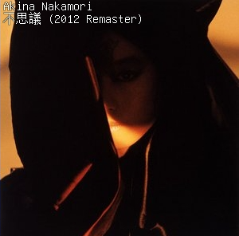

# lastfm-collage-generator

Generate a collage of your most-listened album art from Last.fm. Originally inspired by [tapmusic](https://tapmusic.net), though open-source and built in TS. 

Non-latin scripts are fully supported via [Unifont](https://unifoundry.com/unifont/index.html):

## Configuration

| Variable | Required | Description |
|---|---|---|
| `LASTFM_API_KEY` | ✓ | Your [Last.fm API key](https://www.last.fm/api/account/create) |
| `BASEURL` | ✓ | The Last.fm "top albums" Base URL, currently: http://ws.audioscrobbler.com/2.0/?method=user.gettopalbums  |
| `CACHE_SIZE` | | Cache size measured in items, defaults to 500 (Estimated memory ceiling of ~250MB, go higher if you're on something more substantial than my vps)  |
| `PORT` | | Port, default is 3000 |
| `LOG_LEVEL` | | Log level, defaults to "debug" |

### Stack

- [Bun](https://bun.sh) — runtime
- [Hono](https://hono.dev) — web framework
- [@napi-rs/canvas](https://github.com/Brooooooklyn/canvas) — image rendering
- [Pino](https://getpino.io) — logging

